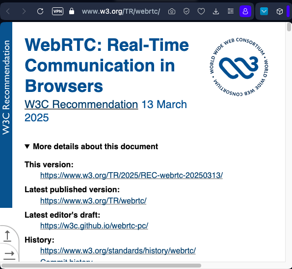

# WebRTC para SSB/Oasis — Sesión formativa

> **Audiencia**: equipo devOps · implementación *ad hoc* sobre SSB/Oasis (Solar Net Hub)
>
> **Principio**: *don't repeat yourself* — cada concepto se explica una vez; el detalle de implementación vive en [PLAN_OASIS.md](./PLAN_OASIS.md).



---

### Índice

1. [Transmisión](#1-transmisión) — 1.1 [Señalización SDP](#11-señalización-oferta-y-respuesta) · 1.2 [Tres capas](#12-tres-capas-de-comunicación) · 1.3 [ICE](#13-descubrimiento-de-ruta-ice) · 1.4 [STUN](#14-stun--ip-pública) · 1.5 [TURN](#15-turn--relay-para-nats-simétricos) · 1.6 [Ecosistema](#16-el-ecosistema-de-implementaciones) (1.6.1 [Node.js](#161-librerías-webrtc-para-nodejs-sin-navegador) · 1.6.2 [Otros lenguajes](#162-librerías-webrtc-en-otros-lenguajes-relevantes-para-22) · 1.6.3 [Decisión](#163-análisis-para-la-decisión)) · 1.7 [Caso SSB-Oasis](#17-el-caso-ssb-oasis-solar)
2. [Consumo de la transmisión](#2-consumo-de-la-transmisión) — 2.1 [Alternativas de retransmisión HTML/CSS al navegador](#21-alternativas-de-retransmisión-htmlcss-al-navegador) · 2.2 [Servidor media dedicado](#22-servidor-media-dedicado-la-alternativa-fuera-de-la-caja) · 2.3 [Seguridad](#23-seguridad-csrf-csp-y-la-tensión-webrtc--tor)
3. [Implementación](#3-implementación)
4. [Glosario](#4-glosario)

---

## 1. Transmisión

WebRTC (Web Real-Time Communication) es una tecnología para la comunicación en tiempo real sobre la Web.

**Especificaciones**:
- [W3C WebRTC 1.0](https://www.w3.org/TR/webrtc/) — API para navegadores
- [IETF RFC 8825](https://datatracker.ietf.org/doc/html/rfc8825) — Overview: Real-Time Communication in WEB-browsers
- [IETF RFC 8826](https://datatracker.ietf.org/doc/html/rfc8826) — Security Considerations
- [IETF RFC 8829](https://datatracker.ietf.org/doc/html/rfc8829) — JSEP (JavaScript Session Establishment Protocol)
- [IETF RFC 8831](https://datatracker.ietf.org/doc/html/rfc8831) — WebRTC Data Channels

#### Ficha técnica del protocolo

| Capa | Protocolo | Puerto | Función |
|---|---|---|---|
| **Señalización** | SDP (Session Description Protocol) | N/A (fuera de banda) | Negociación de capacidades y direcciones |
| **Descubrimiento** | ICE (RFC 8445) | Dinámico (UDP) | Encontrar la mejor ruta entre peers |
| **NAT traversal** | STUN (RFC 8489) / TURN (RFC 8656) | 3478 (STUN), 443 (TURN/TLS) | Resolver IP pública / relay |
| **Transporte seguro** | DTLS 1.2 (RFC 6347) | Sobre ICE | Handshake criptográfico, intercambio de claves |
| **Media** | SRTP (RFC 3711) | Sobre DTLS | Audio/vídeo cifrado (Opus, VP8/H.264) |
| **Datos** | SCTP (RFC 4960) sobre DTLS | Sobre DTLS | DataChannels: mensajes arbitrarios, fiable u ordenado configurable |
| **Codecs obligatorios** | Opus (audio), VP8 (vídeo) | — | Mínimo común garantizado por la spec |

### 1.1 Señalización: oferta y respuesta

WebRTC no define cómo se intercambia la señalización — eso queda fuera del protocolo ("fuera de banda"). Lo que sí define es el formato: **SDP** (Session Description Protocol). El flujo es:

```
  Peer A                          Señalización                         Peer B
  ══════                       (cualquier canal)                       ══════
    │                                                                    │
    │── createOffer() ──────────────────────────────────────────────────>│
    │   (SDP: codecs, ICE candidates, fingerprint DTLS)                  │
    │                                                                    │
    │                                                    setRemoteDescription(offer)
    │                                                    createAnswer()
    │                                                                    │
    │<─────────────────────────────────────────────── answer (SDP) ──────│
    │                                                                    │
    │   setRemoteDescription(answer)                                     │
    │                                                                    │
    │◄══════════════ DTLS handshake + SRTP/SCTP ════════════════════════►│
    │                     Canal abierto                                  │
```

El SDP contiene: codecs soportados, candidatos ICE (IPs y puertos), fingerprint del certificado DTLS, y los media tracks ofrecidos. Cada peer incluye sus candidatos ICE en el SDP (o los envía progresivamente via *trickle ICE*).

> Para el flujo completo aplicado a Oasis (con formularios HTML, sin JS), ver [PLAN_OASIS.md § Flujo de datos detallado](./PLAN_OASIS.md#flujo-de-datos-detallado).

### 1.2 Tres capas de comunicación

La comunicación en tiempo real sobre la Web puede verse como tres capas (datos / media-stream / archivos) que: a) se establecen sobre la Web, b) se mantienen entre clientes.

```
                    ┌───────────────────────────────────┐
                    │       Señalización (SDP)          │
                    │    (HTTP, WebSocket, SSB, manual) │
                    └─────────┬─────────────────────────┘
                              │ establece
         ┌────────────────────┼─────────────────────┐
         │                    │                     │
  ┌──────┴──────┐    ┌────────┴────────┐    ┌───────┴───────┐
  │ DataChannel │    │  Media Stream   │    │    Files      │
  │   (SCTP)    │    │    (SRTP)       │    │  (SCTP bin)   │
  │             │    │                 │    │               │
  │ mensajes    │    │ audio: Opus     │    │ arraybuffer   │
  │ texto/bin   │    │ vídeo: VP8/H264 │    │ chunked       │
  │ chat, JSON  │    │ tracks          │    │ con progreso  │
  └──────┬──────┘    └────────┬────────┘    └───────┬───────┘
         │                     │                    │
         └─────────────────────┼────────────────────┘
                               │
                    ┌──────────┴────────────────────────┐
                    │  Transporte: DTLS-SRTP sobre ICE  │
                    │          (peer-to-peer)           │
                    └───────────────────────────────────┘
```

Las tres capas comparten el mismo canal ICE (misma conexión UDP), multiplexadas por DTLS. La señalización solo interviene al inicio — después, todo el tráfico es directo entre peers.

### 1.3 Descubrimiento de ruta: ICE

En el caso trivial de una LAN la necesidad de "encontrar el mejor camino entre los clientes" no demanda gran esfuerzo del scanner ICE.

ICE (Interactive Connectivity Establishment, [RFC 8445](https://datatracker.ietf.org/doc/html/rfc8445)) funciona en tres fases:

1. **Gathering** — cada peer recopila sus *candidatos* (direcciones IP:puerto por las que podría recibir tráfico):
   - **host**: IPs locales del dispositivo (ej. `192.168.1.50:54321`)
   - **srflx** (server reflexive): IP pública descubierta vía STUN (ej. `85.34.22.10:54321`)
   - **relay**: dirección asignada por un servidor TURN (ej. `turn.example.com:443`)

2. **Connectivity checks** — se forman *pares de candidatos* (uno local + uno remoto) y se prueban con STUN Binding Requests directos entre peers. Cada par recibe una prioridad calculada.

3. **Nomination** — el par que logra conectividad con mejor prioridad se elige como ruta activa. Si la red cambia (WiFi → 4G), ICE puede re-evaluar (*ICE restart*).

En LAN, el candidato `host` conecta directamente y el proceso termina en milisegundos. En WAN entran en juego STUN y TURN.

### 1.4 STUN — IP pública

En las WAN la cosa se complica. Hay clientes que saben (porque la tienen estática) su IP pública y otros que necesitan de un servidor STUN para saberla.

STUN (Session Traversal Utilities for NAT, [RFC 8489](https://datatracker.ietf.org/doc/html/rfc8489)) es un protocolo ligero de pregunta-respuesta:

```
  Cliente                    Servidor STUN
  ═══════                    ═════════════
    │                              │
    │── Binding Request (UDP) ────>│
    │                              │ (ve la IP:puerto de origen
    │                              │  tras atravesar el NAT)
    │<── Binding Response ─────────│
    │    XOR-MAPPED-ADDRESS:       │
    │    85.34.22.10:54321         │
    │                              │
```

El cliente ahora sabe su IP pública (`85.34.22.10:54321`) y la incluye como candidato *srflx* en el SDP. Si el NAT es de tipo *full cone* o *restricted cone*, el otro peer puede enviar paquetes directamente a esa dirección. El servidor STUN no retransmite tráfico — solo responde la pregunta.

Servidores STUN públicos habituales: `stun:stun.l.google.com:19302`, `stun:stun.stunprotocol.org:3478`.

### 1.5 TURN — relay para NATs simétricos

En otros casos los clientes no están conectados "literalmente" en la Web sino que son sus redes (aguas abajo del NAT) las que están presentes. Y, así, cada cliente se conecta a un servidor TURN que les hace el relay.

TURN (Traversal Using Relays around NAT, [RFC 8656](https://datatracker.ietf.org/doc/html/rfc8656)) es el fallback cuando STUN falla (NATs simétricos, firewalls corporativos). A diferencia de STUN, TURN **sí retransmite todo el tráfico**:

```
  Peer A                   Servidor TURN                    Peer B
  ══════                   ════════════                     ══════
    │                            │                            │
    │── Allocate Request ───────>│                            │
    │<── Allocate Response ──────│                            │
    │   (relay addr: T:49152)    │                            │
    │                            │                            │
    │── CreatePermission(B) ────>│                            │
    │── ChannelBind(B, 0x4001) ─>│                            │
    │                            │                            │
    │══ datos (via canal) ══════>│══ relay ══════════════════>│
    │<══════════════════════════ │<═══════════════════════════│
    │        (todo el tráfico pasa por TURN)                  │
```

**Coste**: TURN consume ancho de banda y CPU en el servidor (es un proxy UDP/TCP). Por eso se usa solo como último recurso — ICE siempre prefiere candidatos host o srflx.

> Para opciones de despliegue TURN en el contexto Oasis (coturn auto-hospedado vs. Metered.ca), ver [PLAN_OASIS.md § ICE / STUN / TURN](./PLAN_OASIS.md#ice--stun--turn).

### 1.6 El ecosistema de implementaciones

Buscando en GitHub o npm encuentras las mil y una implementaciones WebRTC con clientes de scripting orquestados con su UI en el navegador, integrándose nativamente en forma multimodal con la API del propio navegador.

El paradigma Web no es exactamente el paradigma HTML5, que es un subconjunto. Hay una web HTML/CSS sin JavaScript en cliente. WebRTC entonces debe verse como un paradigma de **transmisión / consumo de la transmisión**: si bien se usa la tecnología estándar para la transmisión, se disocia en la capa de consumo, actuando como relay.

Si antes vimos que abundaban ejemplos de scripting-cliente, los servicios TypeScript/Node.js puros son escasos.

#### 1.6.1 Librerías WebRTC para Node.js (sin navegador)

| Librería | Tipo | dl/semana npm | Licencia | Estado | DataChannels | Media tracks | Notas |
|---|---|---|---|---|---|---|---|
| **[node-datachannel](https://github.com/murat-dogan/node-datachannel)** | Binding C++ (libdatachannel) | 42.5k | MPL 2.0 | Activo (v0.32, mar 2026) | ✅ | ✅ | Binario ~8 MB. WebSocket integrado. Polyfill `RTCPeerConnection` para usar con simple-peer. **Elegida para Oasis.** |
| **[werift](https://github.com/shinyoshiaki/werift-webrtc)** | Implementación pura TS | 27.2k | MIT | Activo (v0.22, mar 2026) | ✅ | ✅ (sendonly/recvonly/sendrecv, multi track) | Sin binarios nativos: 100% TypeScript. Simulcast recv, BWE sender-side. Compatibilidad verificada: Chrome, Firefox, Pion, aiortc. SFU de referencia: [node-sfu](https://github.com/shinyoshiaki/node-sfu). |
| **[mediasoup](https://mediasoup.org/)** | SFU (Node.js + workers C++) | 20.3k | ISC | Activo (v3.19, mar 2026) | ✅ | ✅ (SFU completa) | No es una librería P2P — es un **servidor SFU** embebible. Multi-stream, simulcast, SVC, congestion control. Signaling-agnostic. Worker C++ sobre libuv. También disponible como crate Rust. 28 dependents, 6.39 MB. |
| **[livekit-server-sdk](https://github.com/livekit/node-sdks)** | SDK para LiveKit server (Go) | 365k | Apache 2.0 | Activo (v2.15, 2026) | ✅ (data streams) | ✅ (SFU completa) | **No se embebe en Node.js**: LiveKit es un servidor Go independiente. El SDK Node.js gestiona rooms, tokens JWT, webhooks. Requiere Redis. Incluye TURN integrado. Pesado para RPi (>100 MB RAM). |
| **[node-webrtc (wrtc)](https://github.com/nicktomlin/node-webrtc)** | Binding libwebrtc (Google) | ~2k (residual) | BSD | ⚠️ Archivado (2022) | ✅ | ✅ | La referencia histórica. Binarios de 80+ MB, builds rotos en Node 18+. No usar en proyectos nuevos. |
| **[simple-peer](https://github.com/nicktomlin/simple-peer)** | Wrapper sobre wrtc/browser | ~150k | MIT | ⚠️ Bajo mantenimiento | ✅ | ✅ (vía browser API) | Abstrae la API WebRTC. En Node depende de `wrtc` (archivado). En browser funciona bien. **Ojo**: node-datachannel incluye polyfill compatible con simple-peer. |
| **[peerjs-server](https://github.com/nicktomlin/peerjs-server)** | Solo señalización | ~10k | MIT | Activo | ❌ (solo relay SDP) | ❌ | No hace WebRTC en Node — solo coordina señalización entre browsers. |

#### 1.6.2 Librerías WebRTC en otros lenguajes (relevantes para §2.2)

La exploración de servidores media dedicados (§2.2) amplía el ecosistema más allá de Node.js. El equipo que decida la arquitectura debe conocer estas opciones:

| Librería / Servidor | Lenguaje | Tipo | Estrellas | Licencia | DataChannels | Media | Notas |
|---|---|---|---|---|---|---|---|
| **[libdatachannel](https://github.com/paullouisageneau/libdatachannel)** | C/C++ | Librería | ~2.7k | MPL 2.0 | ✅ | ✅ | La base de `node-datachannel`. Ligera, sin Google bloat. Bindings: Rust, Node.js, Unity, WASM. IPv6, Trickle ICE, SRTP, mDNS candidates. Servidor STUN/TURN propio: [Violet](https://github.com/paullouisageneau/violet). |
| **[Pion/webrtc](https://github.com/pion/webrtc)** | Go | Librería | ~14k | MIT | ✅ | ✅ | La referencia en Go. go2rtc y MediaMTX están construidos sobre Pion. Pura Go, sin CGO. La comunidad @pion mantiene también pion/turn, pion/ice, pion/dtls. |
| **[go2rtc](https://github.com/AlexxIT/go2rtc)** | Go (Pion) | Servidor media | ~7k | MIT | ❌ | ✅ (MJPEG, HLS, WebRTC, RTSP, etc.) | Detalle en §2.2 Arq.1. Binario ~15 MB. Captura v4l2/ALSA directa. |
| **[MediaMTX](https://github.com/bluenviron/mediamtx)** | Go (Pion) | Servidor media | ~13k | MIT | ❌ | ✅ (RTSP↔HLS↔WebRTC auto-conversión) | Detalle en §2.2 Arq.2. rpicam nativo. |
| **[Janus Gateway](https://github.com/meetecho/janus-gateway)** | C | Gateway WebRTC | ~8.5k | GPL 3.0 | ✅ | ✅ (SFU/MCU, plugins) | Detalle en §2.2 Arq.C. Requiere JS en cliente para WebRTC handshake. |
| **[aiortc](https://github.com/aiortc/aiortc)** | Python | Librería | ~4.5k | BSD | ✅ | ✅ | WebRTC puro en Python (asyncio). Útil para integración con ML/AI, pero Python no está en el stack SNH. |
| **[LiveKit](https://github.com/livekit/livekit)** | Go | SFU completa | ~22k | Apache 2.0 | ✅ | ✅ (SFU, simulcast, E2EE) | El SFU open-source más popular. TURN integrado. SDKs en JS, Python, Go, Rust, Swift, Kotlin. Demasiado pesado para RPi 3B. |

#### 1.6.3 Análisis para la decisión

**Patrón**: la gran mayoría de los ~2.000 paquetes npm que mencionan "webrtc" son clientes de scripting para el navegador, wrappers de señalización, o bindings obsoletos. Las implementaciones backend-only viables se organizan en tres familias:

```
  ┌────────────────────────────────────────────────────────────────────┐
  │              MAPA DE DECISIÓN: WebRTC backend                      │
  ├────────────────────────────────────────────────────────────────────┤
  │                                                                    │
  │  ¿Necesitas P2P puro (2 peers)?                                    │
  │    SÍ → node-datachannel (binding C++, ligero, elegida)            │
  │         werift (TypeScript puro, sin compilar, más portable)       │
  │                                                                    │
  │  ¿Necesitas SFU (muchos peers, rooms)?                             │
  │    SÍ → mediasoup (embébelo en tu Node.js)                         │
  │         LiveKit (servidor Go aparte, pesado, cloud-ready)          │
  │                                                                    │
  │  ¿Necesitas servir media al browser SIN JS?                        │
  │    SÍ → go2rtc (★ MJPEG/HLS sin ffmpeg, binario Go, §2.2)          │
  │         MediaMTX (rpicam nativo para CSI, auto-conversión)         │
  │         ffmpeg directo → HLS estático (mínimo, sin servidor)       │
  │                                                                    │
  │  ¿Necesitas solo señalización (WebRTC corre en browsers)?          │
  │    SÍ → peerjs-server, socket.io, o SSB nativo                     │
  │                                                                    │
  └────────────────────────────────────────────────────────────────────┘
```

**node-datachannel vs. werift — la elección P2P para Oasis**:

| Criterio | node-datachannel | werift |
|---|---|---|
| **Rendimiento media** | C++ nativo (libdatachannel): menor CPU, GC no aplica | TypeScript puro: más CPU, sujeto a GC de V8 |
| **Compilación** | Requiere prebuild o compilar C++ (N-API v8): funciona en Linux/macOS/Windows, ARM64 probado | `npm install` sin compilar: funciona donde corra Node.js |
| **Tamaño binario** | ~8 MB el addon nativo | ~3.5 MB (solo JS/TS, unpacked) |
| **API** | Propia (no idéntica a browser API), pero incluye polyfill `RTCPeerConnection` | En camino hacia API compatible con browser (roadmap v2.0) |
| **WebSocket integrado** | ✅ (cliente y servidor) | ❌ (traer propio) |
| **Madurez media tracks** | Completa: SRTP, media sobre DTLS, probada en producción | Completa: sendonly/recvonly/sendrecv, multi-track, simulcast recv |
| **Comunidad** | Patrocinado por Streamr; 1 maintainer principal | 1 maintainer principal; interop verificada con Pion/aiortc/sipsorcery |
| **Riesgo** | Si libdatachannel deja de compilar en ARM64, se necesita cross-compile | Si el rendimiento es insuficiente en RPi 3B (1 GB RAM, TS puro + ffmpeg) |

**mediasoup — ¿por qué no para Oasis?** mediasoup es un SFU de producción usado por grandes plataformas (20k dl/sem, 28 dependents). Pero es overkill para Oasis:
- Diseñado para **N peers en rooms** (videoconferencia grupal), no para 2 peers P2P.
- Workers C++ sobre libuv: buena performance, pero consume más RAM (~50-80 MB) que una PeerConnection simple (~15 MB).
- API de bajo nivel: exige escribir toda la lógica de señalización, transports, producers/consumers.
- **Sin embargo**, si Oasis evolucionara hacia salas de conferencia (3+ participantes), mediasoup sería la opción Node.js. Registrar para futuro.

**LiveKit — ¿por qué no para Oasis?** LiveKit es el SFU open-source más popular (22k ★), con SDKs para todo, TURN integrado, E2EE, y cloud managed option. Pero:
- Es un **servidor Go separado** que requiere Redis. En RPi 3B consume >100 MB RAM.
- Está diseñado para escenarios cloud-scale, no para un dispositivo embebido solar.
- El SDK Node.js es solo un controlador (tokens, rooms, webhooks), no un stack WebRTC.
- **Sin embargo**, si el proyecto crece a una red de Solar Net Hubs con videollamadas grupales, LiveKit en un servidor central es una opción seria. Registrar para futuro.

### 1.7 El caso SSB-Oasis-Solar

En el dispositivo ssb-oasis-solar la RPi 3 Model B tiene un Yocto (Poky 4.3.4, `MACHINE=raspberrypi3-64`) que separa la capa de usuario de la de sistema, y la app Oasis corre dentro de un contenedor Docker→Debian Bookworm en su espacio Node.js. Su UI es un servidor Express con un sistema de plantillas HTML-CSS.

El dispositivo tiene **GPU VideoCore IV** con encoder H.264 por hardware, accesible vía `rpicam-vid` (cámara CSI) o V4L2 M2M. Esto permite codificar vídeo a ~5% CPU frente al ~30–50% de un encoder software — decisivo con 1 GB de RAM compartida entre CPU y GPU, alimentado por un panel solar de 22W.

> Para la ficha técnica completa del dispositivo (SoC, RAM, energía, red, software instalado), ver [§2.2 — Perfil del dispositivo destino](#perfil-del-dispositivo-destino).

**Dato relevante**: el Solar Net Hub incluye **Tor + Privoxy** para enrutar tráfico por la red onion, y **Mumble** (VoIP Opus) ya instalado. Ambos afectan las decisiones arquitectónicas — ver [§2.3 — Seguridad](#23-seguridad-csrf-csp-y-la-tensión-webrtc--tor).

Una solución pasa por:

1. Conexión de los periféricos multimodales a la RPi.
2. Configurarlos para Node.js (o para un servidor media dedicado — ver [§2.2](#22-servidor-media-dedicado-la-alternativa-fuera-de-la-caja)).
3. Una retransmisión multimodal basada en `node-datachannel` + `ffmpeg`, o alternativamente un servidor media como go2rtc.

**Alternativas evaluadas**:

| Opción | Descripción | Veredicto |
|---|---|---|
| JS en cliente (PR original) | `getUserMedia` + `RTCPeerConnection` en el navegador | Rechazado por mantenedores de Oasis: "no client-side JS" |
| werift (TS puro) | Todo en TypeScript, sin binarios nativos | Viable, pero menor rendimiento para media tracks |
| **node-datachannel + ffmpeg** | DataChannels + media vía ffmpeg como captura/decode | **Elegida**: ligero, binarios pequeños, acceso directo a hardware |

**Pipeline de transmisión por pista**:

| Pista | Captura (origen) | Codec transporte | Unidad de transmisión | Protocolo |
|---|---|---|---|---|
| **Datos** | Texto/JSON desde formulario HTML | N/A | Mensajes SCTP (hasta 256 KB) | SCTP sobre DTLS |
| **Audio** | `ffmpeg -f avfoundation\|pulse\|dshow` (mic) | Opus a 48 kHz | Paquetes RTP de 20 ms (~160 bytes/paquete) | SRTP sobre DTLS |
| **Vídeo** | `ffmpeg -f avfoundation\|v4l2\|dshow` (cám) | VP8 o H.264 (HW si disponible) | Paquetes RTP ~1200 bytes (un frame = múltiples paquetes) | SRTP sobre DTLS |
| **Archivos** | Buffer leído desde disco | N/A | Chunks binarios por DataChannel | SCTP sobre DTLS (fiable, ordenado) |

> Para arquitectura completa con diagramas de pipeline, ver [PLAN_OASIS.md § Arquitectura de media streams](./PLAN_OASIS.md#arquitectura-de-media-streams).

---

## 2. Consumo de la transmisión

Siendo una tecnología de la W3C, WebRTC es utillería para un consumo en el navegador. El ecosistema sobre la máquina de V8 y las modernas combinaciones con WebAssembly son ese entorno aséptico sobre las máquinas (y su sistema operativo) donde el navegador se encarga de habilitar micrófono y cámara, altavoces en un marco general. El desarrollo de la app WebRTC da todo esto *for granted*, siendo el usuario y su gestión de permisos con el navegador una condición *sine qua non* que no entra en la ecuación.

#### App en navegador vs. app nativa/servidor

```
  App WebRTC en navegador                    App WebRTC en servidor (Oasis)
  ═══════════════════════                    ═══════════════════════════════

  ┌─────────────────────────┐          ┌───────────────────────────────┐
  │   Navegador (sandbox)   │          │   Navegador (solo render)     │
  │                         │          │   HTML/CSS puro, sin JS       │
  │  JS → getUserMedia()    │          │    MJPEG + <audio>       │
  │  JS → RTCPeerConnection │          └───────────┬───────────────────┘
  │  JS → <video>/<audio>   │                      │ HTTP
  └──────────┬──────────────┘    ┌─────────────────┴────────────────┐
             │ WebRTC nativo     │   Node.js (servidor local)       │
  ┌──────────┴──────────────┐    │                                  │
  │  API del navegador      │    │  node-datachannel (WebRTC).      │
  │  (permisos, hardware,   │    │  ffmpeg (captura mic/cam)        │
  │   codecs, red)          │    │  Koa (HTTP + vistas)             │
  └──────────┬──────────────┘    └────────────────┬─────────────────┘
             │                                    │
  ┌──────────┴──────────────┐        ┌────────────┴──────────────────┐
  │  Sistema operativo      │        │   Sistema operativo           │
  │  (mic, cam, red, GPU)   │        │   (mic, cam, red, GPU)        │
  └─────────────────────────┘        └───────────────────────────────┘
```

La diferencia clave: en el navegador, la **VM de JavaScript** (V8/SpiderMonkey) actúa como intermediaria entre la app y el hardware, con un sistema de permisos gestionado por el usuario ("permitir cámara"). En el servidor, Node.js accede directamente al hardware vía `ffmpeg` — los permisos son los del sistema operativo, no los del navegador.

Desacoplando esta capa del protocolo, quedan los dos elementos nítidos:

- a) Los clientes WebRTC (y la transmisión).
- b) El despliegue o consumo de la transmisión en la UI.

#### Media stream a nivel de sistema operativo

```
  ┌──────────────────────────────────────────┐
  │         Hardware del dispositivo         │
  │   🎤 Mic ────┐                           │
  │   🎥 Cam ────┤───> Drivers del SO        │
  │   🔊 Spk <───┘       (ALSA, CoreAudio,   │
  │                      DirectShow)         │
  └──────────────────┬───────────────────────┘
                     │
         ┌───────────┴───────────────┐
         │  ffmpeg (child_process)   │  Captura: PCM/RAW → encode (Opus, VP8)
         │  Captura + codificación   │  Decode:  RTP → MJPEG / PCM
         └───────────┬───────────────┘
                     │ RTP
         ┌───────────┴───────────────┐
         │  node-datachannel         │  Transporte: DTLS-SRTP peer-to-peer
         │  (media tracks + DC)      │
         └───────────────────────────┘
```

#### Media stream a nivel de navegador (consumo en Oasis)

```
  ┌──────────────────────────────────────────┐
  │        Servidor Node.js (Oasis)          │
  │                                          │
  │  GET /webrtc/media/video                 │  Content-Type: multipart/x-mixed-replace
  │   → ffmpeg decode RTP → MJPEG frames     │  (cada frame es un JPEG independiente)
  │                                          │
  │  GET /webrtc/media/audio                 │  Content-Type: audio/ogg (o audio/wav)
  │   → ffmpeg decode RTP → OGG/PCM chunks   │  Transfer-Encoding: chunked
  │                                          │
  └───────────────────┬──────────────────────┘
                      │ HTTP
  ┌───────────────────┴────────────────────────┐
  │       Navegador (cero JavaScript)          │
  │                                            │
  │             │  MJPEG: el browser renderiza frames
  │  <audio src="/webrtc/media/audio"          │  Audio: reproducción nativa streaming
  │         autoplay controls>                 │
  │                                            │
  └────────────────────────────────────────────┘
```

> Para pipeline completo con detalle de ffmpeg por OS, ver [PLAN_OASIS.md § Reproducción en el navegador sin JavaScript](./PLAN_OASIS.md#reproducción-en-el-navegador-sin-javascript).

### 2.1 Alternativas de retransmisión HTML/CSS al navegador

La decisión pendiente: **¿cómo entrega el servidor Node.js audio y vídeo al navegador sin JavaScript?** Estas son las técnicas viables, con su soporte real a marzo 2026:

#### Vídeo

| Técnica | HTML | Mecanismo servidor | Latencia | BW | Soporte browser (sin JS) | Paquetes npm |
|---|---|---|---|---|---|---|
| **MJPEG sobre ``** | `` | `multipart/x-mixed-replace`; cada parte es un JPEG | 100–300 ms | Alto (×10 vs H.264) | **Universal** (todos los browsers) | [`mjpeg-server`](https://www.npmjs.com/package/mjpeg-server) (7.8k dl/sem), [`mjpeg-proxy`](https://www.npmjs.com/package/mjpeg-proxy) (4.3k dl/sem) |
| **HLS sobre `<video>`** | `<video src="/stream.m3u8">` | ffmpeg genera segmentos `.ts` + playlist `.m3u8`; servidor sirve archivos estáticos | 2–6 s (por segmentos) | Bajo (H.264 eficiente) | **Chrome 142+, Safari 6+, Android, Samsung, Firefox Android 148+**. No: Firefox desktop, Edge Chromium <146. (~79% global) | [`hls-parser`](https://www.npmjs.com/package/hls-parser), ffmpeg nativo (`-f hls`) |
| **JPEG periódico + `<meta refresh>`** | `` + `<meta http-equiv="refresh" content="1">` | Sirve último frame capturado como imagen estática; el browser recarga la página | 1–10 s (según intervalo) | Mínimo (1 JPEG/recarga) | **Universal** | Ninguno necesario (un `GET` que sirve un JPEG) |
| **GIF animado generado** | `` | ffmpeg genera GIF en bucle con los últimos N frames | 1–3 s | Alto (GIF ineficiente) | **Universal** | [`ffmpeg-stream`](https://www.npmjs.com/package/ffmpeg-stream) (6.6k dl/sem) |

#### Audio

| Técnica | HTML | Mecanismo servidor | Latencia | Soporte browser (sin JS) | Notas |
|---|---|---|---|---|---|
| **OGG/Opus chunked** | `<audio src="/audio" autoplay>` | `Transfer-Encoding: chunked`, `Content-Type: audio/ogg` | ~200 ms | Chrome, Firefox, Edge, Opera. **No: Safari <17** | Mejor balance calidad/BW para remoto |
| **WAV/PCM chunked** | `<audio src="/audio" autoplay>` | `Transfer-Encoding: chunked`, `Content-Type: audio/wav` | ~50 ms | **Universal** | 1.4 Mbps stereo (irrelevante en localhost/LAN) |
| **MP3 chunked** | `<audio src="/audio" autoplay>` | `Transfer-Encoding: chunked`, `Content-Type: audio/mpeg` | ~500 ms | **Universal** | Fallback máximo compatibilidad |
| **HLS audio** | `<video src="/audio.m3u8">` | Segmentos `.ts` solo audio | 2–6 s | Igual que vídeo HLS | Unificado con vídeo si se usa HLS |

#### Análisis comparativo para Oasis

```
  ┌─────────────────────────────────────────────────────────────────┐
  │                        LATENCIA                                  │
  │  50ms        200ms       1s         3s          6s               │
  │   │           │          │          │           │                │
  │   █ WAV       █ MJPEG    │          │           │   audio        │
  │   │           █ OGG      │          │           │                │
  │   │           │  MP3─────█          │           │   vídeo        │
  │   │           │          │  HLS─────█───────────█                 │
  │   │           │          █ meta-ref │           │                │
  └──────────────────────────────────────────────────────────────────┘
```

**Recomendación por escenario**:

| Escenario | Vídeo | Audio | Justificación |
|---|---|---|---|
| **Fase 1: localhost** (dev, tests) | MJPEG `` | WAV/PCM `<audio>` | Latencia mínima, BW irrelevante, universal |
| **Fase 2: LAN** (RPis en red local) | MJPEG `` | OGG/Opus `<audio>` | MJPEG tolerable en LAN (~5 Mbps); Opus ahorra BW audio |
| **Fase 3: Internet** (via TURN) | **HLS `<video>`** | HLS audio integrado | BW limitado por TURN — MJPEG inviable (×10). HLS con H.264 es ~10× más eficiente. Soporte nativo 79%+ global (Chrome 142+, Safari, Android). Firefox desktop: fallback a MJPEG o mensaje "usa Chrome/Safari". |

**Dato clave descubierto**: Chrome 142+ (2026) soporta HLS nativo en `<video src=".m3u8">` sin JavaScript. Combinado con Safari (soporte desde 2012), **HLS nativo cubre ~79% de browsers sin una línea de JS**. Esto hace viable una estrategia dual.

**Matriz real de codecs por navegador** (verificada con documentación go2rtc, marzo 2026):

| Navegador | WebRTC (vídeo) | WebRTC (audio) | HLS nativo | HTTP Progressive | MJPEG `` |
|---|---|---|---|---|---|
| **Chrome 142+ / Edge** | H264, H265 | PCMU, PCMA, OPUS | ❌ (H264+AAC vía HTML) | H264 + AAC/OPUS/MP3 | ✅ |
| **Firefox desktop** | H264 | PCMU, PCMA, OPUS | ❌ | H264 + AAC/OPUS | ✅ |
| **Safari 14+ / iPad** | H264, H265 | PCMU, PCMA, OPUS | ✅ (H264/H265 + AAC) | ❌ (**no soporta**) | ✅ |
| **iPhone Safari 14+** | H264, H265 | PCMU, PCMA, OPUS | ✅ (H264/H265 + AAC) | ❌ | ✅ |
| **Android Chrome** | H264 | PCMU, PCMA, OPUS | ❌ (nativo vía HTML) | H264 + AAC/OPUS | ✅ |

> **Implicación para Oasis**: Safari **no soporta HTTP Progressive Streaming** (`<video>` con stream infinito), pero sí HLS. Firefox desktop no soporta HLS nativo. **No existe un formato único sin JS que cubra el 100%**. De ahí la estrategia dual MJPEG (universal) + HLS (eficiente donde se soporta). MJPEG en `` funciona en todos, siempre.

Esto hace viable una estrategia dual:

```html
<!-- Fase 3: dual MJPEG/HLS según disponibilidad -->
<!-- El servidor detecta User-Agent y sirve la vista apropiada -->

<!-- Para Chrome 142+, Safari, Android: -->
<video src="/webrtc/media/stream.m3u8" autoplay muted playsinline controls></video>

<!-- Fallback para Firefox desktop, navegadores antiguos: -->

<audio src="/webrtc/media/audio" autoplay controls></audio>
```

**Paquetes npm relevantes para el pipeline servidor**:

| Paquete | Función | dl/semana |
|---|---|---|
| [`mjpeg-server`](https://www.npmjs.com/package/mjpeg-server) | Crea endpoint MJPEG desde JPEGs individuales (`multipart/x-mixed-replace`) | 7.8k |
| [`mjpeg-proxy`](https://www.npmjs.com/package/mjpeg-proxy) | Proxy MJPEG con soporte multi-cliente sobre una sola fuente | 4.3k |
| [`ffmpeg-stream`](https://www.npmjs.com/package/ffmpeg-stream) | Wrapper Node.js streams sobre ffmpeg (input/output como streams) | 6.6k |
| [`mjpeg-consumer`](https://www.npmjs.com/package/mjpeg-consumer) | Consume stream MJPEG HTTP y emite buffers JPEG individuales | 71k |
| ffmpeg nativo (`-f hls`) | Genera `.m3u8` + `.ts` directamente. Sin dependencia npm extra. | — |

> **Nota DRY**: el código concreto de `media_capture.js` con la integración de estos paquetes se detalla en [PLAN_OASIS.md § Arquitectura de media streams](./PLAN_OASIS.md#arquitectura-de-media-streams). Aquí solo se documenta la decisión y las alternativas.

### 2.2 Servidor media dedicado: la alternativa "fuera de la caja"

La §2.1 asume que Node.js (Oasis) hace *todo*: recibe pistas WebRTC, decodifica con ffmpeg, y sirve MJPEG/HLS directamente al navegador. Pero existe otra familia de soluciones: **instalar un servidor de media ligero al lado** que se encargue de la conversión de protocolos, dejando a Node.js solo como orquestador y shell HTML.

#### Perfil del dispositivo destino

| | Solar Net Hub |
|---|---|
| **SoC** | BCM2837 quad-core Cortex-A53 @ 1.2 GHz (aarch64) |
| **RAM** | 1 GB LPDDR2 |
| **Almacenamiento** | microSD (velocidad clase 10 típica) |
| **Energía** | PiJuice BC7X (1820 mAh) + panel solar 22W — cada mW cuenta |
| **Puerto cámara** | CSI (ribbon, interfaz nativa RPi) |
| **Audio** | Jack 4 polos stereo (salida); mic: USB o HAT I²S |
| **Red** | WiFi 802.11n, Ethernet 100Base-T, Tor (onion) |
| **SO** | Yocto Poky 4.3.4 (MACHINE=raspberrypi3-64) → Docker → Debian Bookworm |
| **Software relevante** | Firefox, **Mumble (VoIP ya instalado)**, SSB/Oasis, ConnMan, Matchbox WM |

> Fuente: [Solar Net Hub Wiki — Hardware](https://wiki.solarnethub.com/kit/hardware), [Software](https://wiki.solarnethub.com/kit/software).

**Restricción clave**: 1 GB de RAM compartida entre GPU y CPU. Un servidor media debe ser **ultraligero** y preferiblemente un binario estático sin runtime (no más Node.js, no JVM).

#### Los tres candidatos

Se han evaluado tres servidores media que cumplen: binario ARM64, sin dependencias pesadas, capaces de recibir un stream y re-servirlo en formatos consumibles sin JS.

##### A) go2rtc — "la navaja suiza"

| | |
|---|---|
| **Lenguaje** | Go (binario estático ~15 MB) |
| **Entrada** | v4l2, ALSA, RTSP, RTMP, ffmpeg exec, MJPEG, WebRTC (WHEP) |
| **Salida** | MJPEG, HLS (.m3u8), MP4 progressive, WebRTC (WHEP), RTSP, snapshots JPEG |
| **RAM típica** | 20–40 MB |
| **Killer feature** | Captura **directamente** de v4l2 (cámara) y ALSA (mic) → sirve HLS y MJPEG **sin ffmpeg intermedio** |
| **Transcodificación** | PCMA/PCMU/PCM → FLAC automático para MSE/HLS; resampling WebRTC; ffmpeg bajo demanda |
| **Web UI** | Sí (puerto 1984); API HTTP + WebSocket |
| **Repo** | [github.com/AlexxIT/go2rtc](https://github.com/AlexxIT/go2rtc) |

##### B) MediaMTX — "router de protocolos"

| | |
|---|---|
| **Lenguaje** | Go (binario estático ~20 MB) |
| **Entrada** | RTSP, RTMP, HLS, WebRTC, SRT, **rpicam nativo** (sin ffmpeg para cámara CSI) |
| **Salida** | RTSP, RTMP, HLS, WebRTC, SRT, MJPEG snapshots |
| **RAM típica** | 15–30 MB |
| **Killer feature** | Auto-conversión entre protocolos: publica en RTSP y automáticamente sirve HLS, WebRTC, todo sin config |
| **Autenticación** | Sí (internal, HTTP, JWT) |
| **Hooks** | Ejecuta comandos externos al conectar/desconectar (ideal para señalizar a Node.js) |
| **Repo** | [github.com/bluenviron/mediamtx](https://github.com/bluenviron/mediamtx) |

##### C) Janus WebRTC Gateway — "el gateway WebRTC completo"

| | |
|---|---|
| **Lenguaje** | C |
| **Entrada** | WebRTC (es SFU/MCU), RTP |
| **Salida** | WebRTC, RTP (re-streaming) |
| **RAM típica** | 10–20 MB |
| **Killer feature** | SFU/MCU completa: puede hacer forwarding, recording, streaming a navegadores con WebRTC nativo |
| **Riesgo** | Requiere JS en cliente para el handshake WebRTC en navegador → **incompatible con "cero JS"** sin proxy HTTP intermedio |
| **Repo** | [github.com/meetecho/janus-gateway](https://github.com/meetecho/janus-gateway) |

#### Arquitecturas propuestas

##### Arquitectura 1: go2rtc como relay integral (★ recomendada)

```
  ┌───────────────────────────────────────────────────────────────────┐
  │                    Raspberry Pi 3B (Debian/Docker)                │
  │                                                                   │
  │  ┌────────────┐    v4l2/ALSA  ┌──────────┐   HTTP   ┌───────┐     │
  │  │ 🎥 Cam CSI │──────────────>│  go2rtc  │─────────>│ Oasis │     │
  │  │ 🎤 Mic USB │──────────────>│  :1984   │  MJPEG   │ :3000 │     │
  │  └────────────┘               │          │  HLS     │       │     │
  │                               │  (20 MB) │  JPEG    │  HTML │     │
  │                               └──────────┘          └───────┘     │
  │                                     │                   │         │
  │                                 WebRTC                  │         │
  │                                  WHEP                   │         │
  │                                     │                   │         │
  └─────────────────────────────────────┼───────────────────┼─────────┘
                                        │                   │
                              ┌─────────┴───────────────────┴──────────────┐
                              │         Navegador (cero JS)                │
                              │                                            │
                              │     │
                              │  ó                                         │
                              │  <video src="go2rtc:1984/api/stream.m3u8"  │
                              │         autoplay muted playsinline>        │
                              │                                            │
                              │  (Oasis sirve el HTML con las URLs)        │
                              └────────────────────────────────────────────┘
```

**Flujo**: go2rtc captura directamente de v4l2 (cámara) y ALSA (mic), sin ffmpeg. Oasis solo sirve la plantilla HTML con `` o `<video>` apuntando a los endpoints de go2rtc. Node.js queda libre de toda carga de media.

**Config go2rtc.yaml**:
```yaml
streams:
  solar-cam:
    - v4l2:///dev/video0
  solar-mic:
    - alsa:///default
api:
  listen: "127.0.0.1:1984"  # solo acceso local
```

**Ventajas**:
- **Elimina ffmpeg y node-datachannel** del pipeline de media → menos RAM, menos CPU, menos complejidad
- go2rtc reempaqueta PCMA/PCMU→FLAC automáticamente para HLS
- Un solo binario de ~15 MB cubre todo: captura, transcodificación ligera, serving multi-protocolo
- Soporta snapshots JPEG (`/api/frame.jpeg`) para generación de thumbnails o vista estática
- Si en Fase 3 se necesita WebRTC real (peer remoto vía TURN), go2rtc lo habla nativamente por WHEP

**Riesgo**: go2rtc no gestiona la señalización SSB — eso sigue siendo responsabilidad de Node.js. Pero para el caso de cámara local → browser local, la señalización no hace falta.

##### Arquitectura 2: MediaMTX + rpicam (zero-copy cámara CSI)

```
  ┌──────────────────────────────────────────────────────────────────┐
  │                     Raspberry Pi 3B                                │
  │                                                                    │
  │  ┌──────────┐  ribbon   ┌────────────┐  auto    ┌──────────────┐ │
  │  │ 🎥 Cam CSI │────────>│  rpicam-vid  │──RTSP──>│   MediaMTX    │ │
  │  └──────────┘          │  (nativo)    │        │   :8554       │ │
  │                        └────────────┘        │                │ │
  │  ┌──────────┐  ffmpeg                         │  auto-convierte│ │
  │  │ 🎤 Mic    │──────────── RTSP ─────────────>│  RTSP → HLS   │ │
  │  └──────────┘                                │  RTSP → MJPEG │ │
  │                                               └───────┬──────┘ │
  │  ┌──────────┐                                         │         │
  │  │ Node.js   │←── hooks (on_connect/on_disconnect) ────┘         │
  │  │ (Oasis)   │── sirve HTML con URLs a MediaMTX ───────────────> │
  │  └──────────┘                                                    │
  └──────────────────────────────────────────────────────────────────┘
```

**Ventaja diferencial**: MediaMTX usa `rpicam-vid` para acceder a la cámara CSI **sin pasar por v4l2** (zero-copy del GPU al encoder H.264). En una RPi 3B con GPU VideoCore IV, esto libera CPU significativamente. El audio sigue necesitando ffmpeg→RTSP como fuente.

##### Arquitectura 3: Mumble para audio + go2rtc/MediaMTX para vídeo (hybrid)

**Descubrimiento clave**: **Mumble ya está instalado** en el Solar Net Hub. Mumble es un sistema VoIP completo con codec Opus, cancelación de eco, control automático de ganancia, y un protocolo cliente-servidor maduro. ¿Por qué reinventar la rueda del audio?

```
  ┌─────────────────────────────────────────────────────────────────┐
  │                   Raspberry Pi 3B                               │
  │                                                                 │
  │  🎤 Mic ──> Mumble Server (murmurd)  ──┐                        │
  │              (ya instalado, Opus)      │                        │
  │                                        │ Mumble protocol        │
  │  🎥 Cam ──> go2rtc (v4l2 → MJPEG/HLS)  │  (UDP, cifrado)        │
  │                                        │                        │
  └────────────────────────────────────────┼────────────────────────┘
                                           │
                              ┌────────────┴───────────────────────────┐
                              │        Navegador                       │
                              │                                        │
                              │  Vídeo: /<video> desde go2rtc     │
                              │  Audio: Mumble client (web o nativo)   │
                              └────────────────────────────────────────┘
```

**Matiz honesto**: Mumble requiere un cliente — no se puede consumir en `<audio>` puro sin JS. Existe [mumble-web](https://github.com/nicktomlin/nicktomlin) (cliente web), pero usa JS. Sin embargo, si el equipo ya usa Mumble para voz, **no duplicar el canal de audio en WebRTC** es eficiente: Mumble maneja el audio, WebRTC/go2rtc maneja solo vídeo y datos.

##### Arquitectura 4: ffmpeg → HLS estático (la más simple posible)

```
  ffmpeg -f v4l2 -i /dev/video0 \
         -f alsa -i default \
         -c:v libx264 -preset ultrafast -tune zerolatency \
         -c:a aac -b:a 64k \
         -f hls -hls_time 2 -hls_list_size 5 -hls_flags delete_segments \
         /var/www/stream/live.m3u8
```

Oasis sirve `/var/www/stream/` como directorio estático. El navegador consume:
```html
<video src="/stream/live.m3u8" autoplay muted playsinline controls></video>
```

**Sin servidor media, sin node-datachannel, sin paquetes npm para media.** Solo ffmpeg escribiendo segmentos a disco y Oasis sirviéndolos como ficheros estáticos. Funciona en Chrome 142+/Safari sin JS.

**Limitación**: latencia de 4–12 s (HLS inherente); no streaming bidireccional; el disco (microSD) recibe escrituras constantes.

#### Comparativa de arquitecturas

| | Arq. 1: go2rtc | Arq. 2: MediaMTX | Arq. 3: Mumble hybrid | Arq. 4: ffmpeg→HLS |
|---|---|---|---|---|
| **Complejidad** | Baja | Media | Media | Mínima |
| **RAM adicional** | ~20–40 MB | ~15–30 MB + rpicam | ~10 MB (murmurd ya corre) | ~30 MB (ffmpeg) |
| **Latencia vídeo** | 100–300 ms (MJPEG) | 100–300 ms (MJPEG) / 2–6 s (HLS) | 100–300 ms (MJPEG) | 4–12 s (HLS) |
| **Latencia audio** | 200 ms (MJPEG) / 2 s (HLS) | 2–6 s (HLS) | ~50 ms (Mumble nativo) | 4–12 s (HLS) |
| **Necesita ffmpeg** | No (captura v4l2/ALSA directa) | Solo para audio (vídeo CSI nativo) | Solo para vídeo si no usa go2rtc | Sí |
| **Necesita node-datachannel** | Solo si se quiere WebRTC P2P remoto | Solo si WebRTC P2P remoto | Solo para datos/señalización | No |
| **Cero JS en browser** | ✅ | ✅ | ❌ (Mumble client necesita JS) | ✅ |
| **Bidireccional** | ✅ (WHEP + two-way audio) | ✅ (WebRTC) | ✅ (Mumble nativo) | ❌ |
| **Escritura a microSD** | No (streaming en memoria) | No (streaming en memoria) | No | ⚠️ Constante (.ts segments) |

#### Recomendación

**Para Fase 1–2 (LAN)**: **Arquitectura 1 (go2rtc)** es la opción más potente con la menor complejidad. Un solo binario de 15 MB reemplaza ffmpeg + node-datachannel + mjpeg-server + toda la lógica de transcodificación. Captura directamente de v4l2/ALSA, sirve MJPEG (latencia baja) y HLS (eficiencia). Node.js se limita a servir el HTML y gestionar señalización.

**Para Fase 3 (Internet)**: go2rtc habla WebRTC nativamente (WHEP/WISH), por lo que puede ser el endpoint WebRTC sin que Node.js toque media. La señalización WebRTC se gestiona entre go2rtc y el peer remoto, con Node.js como orquestador vía la API HTTP de go2rtc.

**El audio de Mumble** no se descarta como canal complementario: si el equipo ya lo usa, mantener Mumble para conferencias de voz y usar go2rtc solo para vídeo+datos es eficiente y no duplica infraestructura.

> **Nota DRY**: la integración concreta de go2rtc o MediaMTX en el pipeline de Oasis — Dockerfile, supervisord/systemd, configuración de red — se documentará en [PLAN_OASIS.md](./PLAN_OASIS.md) cuando se decida la arquitectura final.

### 2.3 Seguridad: CSRF, CSP y la tensión WebRTC ↔ Tor

#### CSRF en una app sin JS

Oasis rechazó JS en cliente, pero eso tiene una consecuencia de seguridad positiva: sin JS no hay XSS posible (no hay runtime que un atacante pueda secuestrar). El vector restante es **CSRF** — un sitio malicioso en otra pestaña que envía un `<form>` POST a `localhost:3000/webrtc/*`.

Defensa en profundidad (detalle completo en [PLAN_OASIS.md § CSRF](./PLAN_OASIS.md#diferencias-clave-vs-la-versión-anterior-con-js-en-cliente)):

| Capa | Mecanismo | Bloquea en |
|---|---|---|
| **Referer check** | Middleware Koa rechaza POST cuyo `Referer` no sea `localhost:PORT` | Servidor |
| **`SameSite=Strict`** | Cookie de sesión no se envía en requests cross-origin | Navegador |
| **CSP `form-action 'self'`** | Los formularios solo pueden POST a `'self'` | DOM |

Las tres son complementarias. Un atacante necesitaría saltarse las tres simultáneamente.

#### WebRTC y Tor: una tensión fundamental

El Solar Net Hub enruta tráfico por **Tor + Privoxy**. WebRTC, por diseño, necesita conocer la IP real del peer para establecer conexión ICE. Esto crea una tensión:

```
  Tor oculta tu IP  ←──────  CONFLICTO  ──────→  WebRTC revela tu IP
  (privacidad)                                   (para ICE candidates)
```

**Los escenarios y sus implicaciones**:

| Escenario | IP expuesta | Privacidad | Funcionalidad WebRTC |
|---|---|---|---|
| **LAN sin Tor** (Fase 1–2) | IP local (192.168.x.x) | No aplica (red local) | ✅ Plena (ICE candidato host) |
| **Internet con STUN** | IP pública real | ❌ IP revelada al peer y al servidor STUN | ✅ Funciona |
| **Internet con TURN** | IP del servidor TURN | ⚠️ Parcial (el peer ve IP del TURN, no la tuya; pero TURN te conoce) | ✅ Funciona |
| **Todo por Tor** | IP del exit node | ✅ Privacidad máxima | ❌ ICE falla (Tor no deja pasar UDP) |
| **TURN sobre Tor** (`turns:` TCP por Tor) | IP del exit node | ⚠️ TURN conoce tu IP de exit node | ⚠️ Latencia ~500ms+, posible timeout |

**Recomendación para el SNH**:

- **Fase 1–2 (LAN)**: Tor no interviene. WebRTC funciona directamente con candidatos host. Sin conflicto.
- **Fase 3 (Internet) — opción pragmática**: usar TURN propio del pub SSB (no revelas IP a terceros, solo a tu propia infraestructura). Deshabilitar candidatos `srflx` si se quiere evitar exponer la IP pública al peer:
  ```js
  // Forzar relay-only (todo el tráfico por TURN propio):
  { iceTransportPolicy: 'relay' }
  ```
- **Fase 3 — opción máxima privacidad**: no usar WebRTC para media; usar solo DataChannels (datos) por TURN/TCP, que puede funcionar sobre Tor. Media por canal alternativo (Mumble sobre Tor ya funciona en el SNH).

> **Nota**: el navegador Firefox del SNH tiene `media.peerconnection.ice.default_address_only = true` por defecto, lo que limita los candidatos ICE a una sola interfaz. Esto mitiga parcialmente la filtración de IPs múltiples pero no el conflicto fundamental con Tor.

---

## 3. Implementación

Resumen ejecutivo (detalle completo en [PLAN_OASIS.md](./PLAN_OASIS.md)):

La implementación depende de la **decisión arquitectónica de §2.2**. Se presentan ambos caminos:

#### Camino A: node-datachannel + ffmpeg (plan original)

| Fase | Alcance | Ficheros clave |
|---|---|---|
| **1. DataChannel** (solo texto) | Chat peer-to-peer, señalización manual (copy-paste) | `webrtc_model.js`, `webrtc_view.js`, rutas en `backend.js` |
| **2. Señalización SSB** | Offer/answer vía mensajes SSB privados, automático | `signaling/ssb.js`, `signaling/index.js` |
| **3. Media streams** | Audio + vídeo vía ffmpeg → node-datachannel → MJPEG/HLS al browser | `media_capture.js` |
| **4. File transfer** | Envío de archivos por DataChannel con progreso | Extensión de `webrtc_model.js` |

```
  webrtc_view.js ─── renderiza HTML según estado (idle/offer/answer/connected)
       │
  backend.js ───── rutas GET/POST /webrtc/*
       │
  webrtc_model.js ─ estado + node-datachannel (PeerConnection, DataChannel)
       │
  media_capture.js ─ ffmpeg captura → RTP → tracks; decode → MJPEG/HLS HTTP
       │
  signaling/ ───── abstracción: manual | ssb | ssb-lan | socket.io
```

#### Camino B: go2rtc como servidor media (§2.2 Arq. 1)

| Fase | Alcance | Ficheros / componentes |
|---|---|---|
| **1. DataChannel** (solo texto) | Idéntico al camino A | `webrtc_model.js`, `webrtc_view.js`, `backend.js` |
| **2. Señalización SSB** | Idéntico al camino A | `signaling/ssb.js`, `signaling/index.js` |
| **3. Media streams** | go2rtc captura v4l2/ALSA → Oasis sirve HTML con URLs a go2rtc | `go2rtc.yaml` (config), **no se necesita `media_capture.js`** |
| **4. File transfer** | Idéntico al camino A (DataChannel no cambia) | Extensión de `webrtc_model.js` |

```
  webrtc_view.js ─── renderiza HTML con /<video> apuntando a go2rtc:1984
       │
  backend.js ───── rutas GET/POST /webrtc/* (sin rutas de media)
       │
  webrtc_model.js ─ estado + node-datachannel (solo DataChannel, sin media tracks)
       │
  go2rtc ────────── binario independiente: v4l2/ALSA → MJPEG/HLS/WebRTC
       │
  signaling/ ───── abstracción: manual | ssb | ssb-lan | socket.io
```

**Impacto del camino B**: las Fases 1, 2 y 4 son idénticas. La Fase 3 pasa de ~400 líneas de `media_capture.js` (orquestación ffmpeg + streams HTTP) a un fichero `go2rtc.yaml` de ~10 líneas + un binario de 15 MB. El coste es una dependencia externa (Go binary) en vez de código propio (Node.js). La ventaja es que go2rtc ya resuelve la transcodificación, multi-cliente, y serving — código probado por miles de despliegues en Home Assistant y Frigate.

---

## 4. Glosario

| Sigla | Nombre completo | Función en una línea |
|---|---|---|
| **SDP** | Session Description Protocol | Formato para negociar capacidades (codecs, IPs, fingerprints) entre peers |
| **ICE** | Interactive Connectivity Establishment | Descubre la mejor ruta de red entre dos peers |
| **STUN** | Session Traversal Utilities for NAT | Pregunta "cuál es mi IP pública" a un servidor externo |
| **TURN** | Traversal Using Relays around NAT | Relay de tráfico cuando la conexión directa es imposible |
| **DTLS** | Datagram Transport Layer Security | Handshake criptográfico sobre UDP (como TLS pero para datagramas) |
| **SRTP** | Secure Real-time Transport Protocol | Transporte cifrado de audio/vídeo |
| **SCTP** | Stream Control Transmission Protocol | Transporte de datos (DataChannels) sobre DTLS, fiable y/u ordenado |
| **RTP** | Real-time Transport Protocol | Paquetes de media con timestamps y números de secuencia |
| **MJPEG** | Motion JPEG | Secuencia de JPEGs independientes; reproducible en `` via `multipart/x-mixed-replace` |
| **HLS** | HTTP Live Streaming | Protocolo de Apple: playlist `.m3u8` + segmentos `.ts`. Nativo en Safari, Chrome 142+, Android |
| **WHEP** | WebRTC-HTTP Egress Protocol | Estándar IETF para consumir streams WebRTC vía HTTP sin señalización custom |
| **v4l2** | Video4Linux 2 | Framework del kernel Linux para captura de vídeo desde dispositivos (cámaras USB, CSI) |
| **ALSA** | Advanced Linux Sound Architecture | Framework del kernel Linux para captura y reproducción de audio |
| **CSI** | Camera Serial Interface | Bus ribbon de la RPi para conectar cámaras nativas (sin USB, acceso directo al GPU) |
| **SFU** | Selective Forwarding Unit | Servidor que reenvía streams WebRTC sin decodificarlos (baja CPU, baja latencia) |
| **MCU** | Multipoint Control Unit | Servidor que decodifica, mezcla y re-codifica streams — alta CPU, baja complejidad cliente |
| **BWE** | Bandwidth Estimation | Algoritmo que estima el ancho de banda disponible para adaptar bitrate dinámicamente |
| **CSRF** | Cross-Site Request Forgery | Ataque donde un sitio malicioso envía requests a otro en nombre del usuario |
| **CSP** | Content Security Policy | Cabecera HTTP que restringe qué recursos puede cargar/ejecutar una página |
| **WHIP** | WebRTC-HTTP Ingestion Protocol | Estándar IETF para publicar streams WebRTC vía HTTP (complemento de WHEP) |